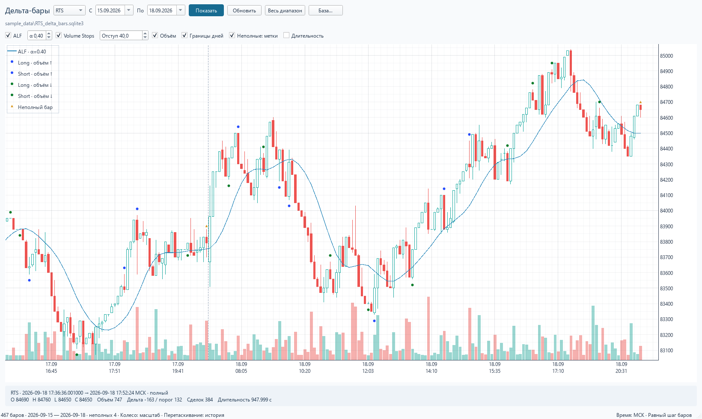
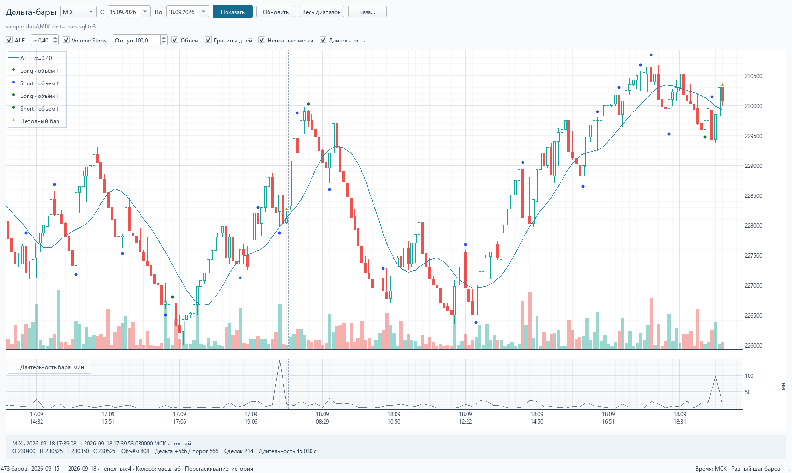

# Проверка просмотрщика 29.09.2026

- 15 автоматических проверок расчётов и интерфейса прошли, включая независимую рекурсию ALF, четыре шаблона Volume Stops, дневные границы, неполные бары, совпадающее время, прогрев, запрет записи SQLite, переключатели, ошибки диапазона и границы масштабирования.
- Импорт finplot при принудительной локали `ru_RU` проверен отдельным процессом после применения локального исправления.
- На копиях реальных баз загружена полная история: RTS — 204 658 баров (03.01.2022–27.09.2026), MIX — 209 824 бара (31.01.2022–28.09.2026). Проверено отображение всего диапазона без потери первой и последней свечи.
- На участке 15–18.09.2026 проверены 467 баров RTS и 473 MIX. Подтверждены переключение между инструментами, ось последовательности, метки неполных баров, объём и дополнительная панель длительности.
- Изображения собственного окна Qt получены в режиме offscreen и визуально проверены. Кириллические подписи, оси, свечи, легенда, сигналы и карточка бара отображаются корректно. Проверка не использовала управление другими приложениями пользователя.
- Окружение Python 3.13.13; версии закреплены в `requirements-chart.txt`. `pip check` не обнаружил конфликтов.

